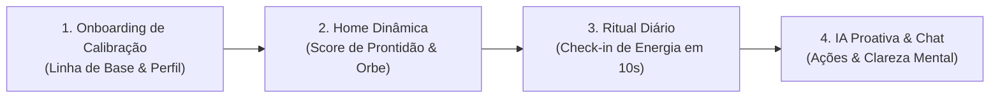

# 🪐 Venus — Inteligência Pessoal de Prontidão (Readiness) & Energia

> **"Não é uma planilha fria de métricas laboratoriais. É o seu consultor pessoal de energia, foco e recuperação diária."**

---

## 🌟 Visão Geral

O **Venus** é um aplicativo iOS de inteligência de **Prontidão (Readiness) e Bateria Diária**, inspirado nos conceitos de recuperação e performance de dispositivos como *Whoop*, *Oura Ring* e *Apple Watch*, porém com uma abordagem **profundamente intuitiva, humana e acolhedora**.

Enquanto a maioria dos aplicativos de saúde foca em números frios e gráficos complexos de difícil interpretação (HRV, RHR, Strain), o Venus traduz o estado do seu corpo e da sua mente em um **Índice de Prontidão Claro** e acionável, apoiado por uma IA generativa conversacional de elite (OpenRouter) e interface tátil viva.
```

┌─────────────────────────────────────────────────────────────┐
│                       🪐 VENUS CORE                         │
│                                                             │
│   [ Check-in Rápido ] ──► [ Behavior & Readiness Engine ]   │
│                                     │                       │
│                                     ▼                       │
│                        [ Score de Prontidão ]               │
│                        (ex: 82% · Foco Máximo)              │
│                                     │                       │
│                                     ▼                       │
│                      [ IA Proativa & Ações ]                │
│             (Orientação de foco, pausas e rotina)           │
└─────────────────────────────────────────────────────────────┘
```

---

## ⚡ Pilares Principais do Aplicativo

### 🔋 1. Índice de Prontidão Diária (Readiness Score)
* **Score de 0 a 100:** Calculado a partir da qualidade do descanso, nível de alerta percebido, carga cognitiva e histórico comportamental.
* **Modos de Prontidão Dinâmicos:**
  * 🚀 **Peak Performance (85–100%):** Janela ideal para trabalho focado, decisões difíceis e esforço intenso.
  * ⚖️ **Foco Sustentável (65–84%):** Bom ritmo de execução com pausas estratégicas programadas.
  * 🛡️ **Modo Manutenção (40–64%):** Priorização do essencial e blindagem contra distrações.
  * 🪫 **Modo Recuperação (<40%):** Foco em desaceleração, redução de carga e restauração de energia.

---

### 🔮 2. Mascote Orbe 2.5D & Experiência Tátil
* **Interface Viva e Expressiva:** O Orbe central da Venus reflete em tempo real o seu nível de energia e humor através de gradientes orgânicos, física de fluidos e expressões interativas.
* **Feedback Háptico Rico:** Respostas táteis dinâmicas (`UIImpactFeedbackGenerator`) que proporcionam uma sensação de toque físico a cada interação.
* **Ciclo Circadiano Automático:** A iluminação e o tom de acolhimento mudam dinamicamente conforme o momento do dia (*Aurora*, *Manhã*, *Tarde*, *Entardecer*, *Noite*).

---

### 🧠 3. IA Conversacional Proativa (OpenRouter Powered)
* **Orientação Contextual:** A IA não é passiva; ela se apoia no seu nível de prontidão para abrir diálogos com contexto real.
* **Memória & Linha de Base:** Lembra dos seus padrões de energia, tom de conversa preferido (*Gentil*, *Direto*, *Reflexivo*, *Motivador*) e tempo disponível.
* **Acolhimento sem Julgamentos:** Traduz sobrecargas e bloqueios em passos simples e acionáveis para o seu dia.

---

### 📊 4. Motor Comportamental (Behavior Engine & Mirror)
* **Mapeamento de Padrões:** Identifica gatilhos dominantes que drenam sua bateria e aponta sua **Janela Crítica de Queda de Energia** (ex: *14h às 16h*).
* **Waveform Semanal:** Linha do tempo visual que conecta hábitos diários com a evolução da sua prontidão ao longo dos dias.
* **Previsões de Tendência:** Alertas inteligentes para antecipar esgotamento antes que ele aconteça.

---

## 📱 Fluxo da Experiência do Usuário



1. **Onboarding Psicológico:** Calibração inicial sem atrito, capturando estilo de recuperação, desafios de carga e tom de voz ideal com efeito de *Labor Illusion* e revelação de perfil.
2. **Home Screen:** Painel central que resume em 1 segundo sua bateria atual, a frase do mascote e os padrões mapeados da semana.
3. **Check-in Ágil:** Registro de estado emocional e corporal em segundos com feedback tátil e atualização instantânea do Readiness.
4. **Espaço Seguro & Chat:** Canal direto com a Venus para planejar o dia, reorganizar prioridades ou desacelerar a mente.

---

## 🛠️ Arquitetura & Tecnologias

* **Linguagem & UI:** Swift 6 (`@Observable`, Strict Concurrency, Sendable) + SwiftUI moderno.
* **Inteligência Artificial:** OpenRouter API (`inclusionai/ling-3.0-flash-fin` via `URLSession` nativo).
* **Persistência:** SwiftData & Repositórios Modulares (armazenamento 100% privado no dispositivo).
* **Design System:** `VenusTheme` (Liquid Glass, materiais transparentes, suporte nativo Dark/Light).
* **Arquitetura de Software:** Clean Architecture orientada a Features (Data, Domain, Presentation) com injeção de dependências desacoplada (`DependencyContainer`).

---

## 🔒 Privacidade & Segurança

* **Privacidade Local First:** Seus check-ins, notas e linha de base permanecem salvos no dispositivo do usuário.
* **Confidencialidade Total:** Dados usados para personalizar a IA são transmitidos com segurança e nunca compartilhados com terceiros.

---

<p align="center">
  <b>Venus</b> • Transforme sentimento em direção. 🪐
</p>
