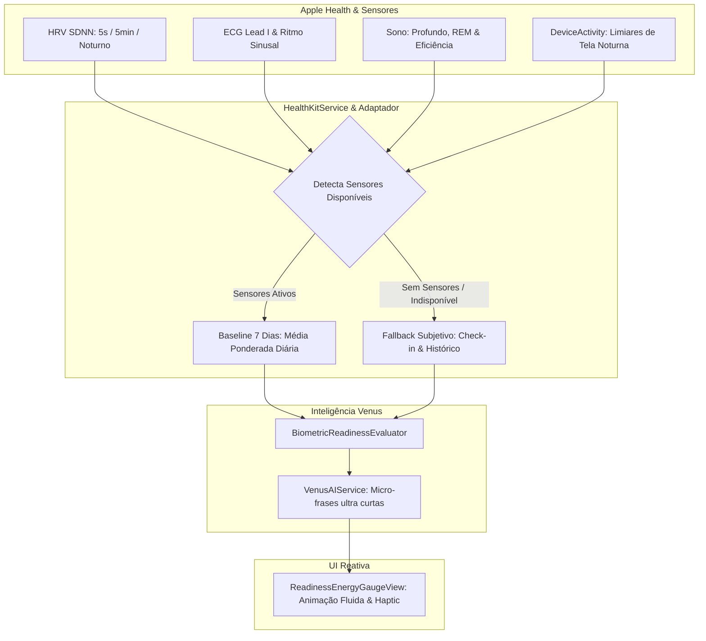

# Venus Biometric & Readiness Engine Specification

> [!NOTE]
> Este documento detalha a arquitetura técnica para integração de **Recovery HRV (Baseline 7 dias)**, **Apple Watch ECG**, **Sono**, **Tempo de Tela** e **Fallback Dinâmico Hardware-Agnóstico** ao motor de prontidão (*Readiness*) da Venus.

---

## 1. Princípios Fundamentais de Design

1. **Hardware-Agnóstico & Degradação Graciosa**:
   - Se o usuário possui um Apple Watch recente com leituras em alta frequência (ex: leituras frequentes de HRV): a Venus usa a amostragem de alta fidelidade.
   - Se o usuário possui um Apple Watch antigo com leituras esparsas (a cada 5-10 min ou noturno): a Venus agrega as amostras disponíveis.
   - Se o usuário **não** possui Apple Watch ou não autorizou o HealthKit: o Readiness funciona 100% via check-in e sinais subjetivos (sem quebrar a interface nem mostrar erros).
   - Se o usuário trocar de relógio ou ativar um novo sensor: o motor detecta a nova disponibilidade em tempo de execução e passa a considerá-la na próxima avaliação.

2. **Baseline Móvel de 7 Dias**:
   - A média individual de recuperação compara o HRV de repouso atual com a média móvel dos últimos 7 dias ($\text{HRV}_{\text{hoje}} / \overline{\text{HRV}}_{7\text{d}}$).

3. **Zero Jargões Médicos & Micro-Copy por IA**:
   - Frases geradas pela LLM de forma ultra concisa e humanizada:
     - **Título (`stateTitle`)**: 1 a 3 palavras (ex: *"Go For It"*, *"Modo Respiro"*, *"Mente Serena"*, *"Poupe Bateria"*).
     - **Subtítulo (`stateSubtitle`)**: 1 frase curta de 6 a 10 palavras (ex: *"Bateria restaurada para criar."*, *"Dia de desacelerar o ritmo."*).

4. **Sincronização Reativa em Tempo Real**:
   - O HealthKit dispara eventos imediatos via `HKObserverQuery` no app, acionando a animação fluida do arco no [`ReadinessEnergyGaugeView`](file:///Users/kaua/Personal/Projetos/Venus/Venus/Features/Home/Presentation/Components/ReadinessEnergyGaugeView.swift).

---

## 2. Diagrama de Fluxo Adaptativo



---

## 3. Arquitetura dos Componentes

### 3.1 `HealthKitServiceProtocol`
Responsável por gerenciar autorizações, observar novas amostras em tempo real e calcular o baseline móvel de 7 dias com agregação flexível de amostras.

```swift
public protocol HealthKitServiceProtocol: Sendable {
    func requestAuthorization() async throws -> Bool
    func observeBiometricUpdates() -> AsyncStream<BiometricSnapshot>
    func fetchBiometricSnapshot() async -> BiometricSnapshot
}
```

### 3.2 `BiometricSnapshot`
Estrutura que encapsula qualquer métrica disponível no momento sem impor obrigatoriedade:

```swift
public struct BiometricSnapshot: Sendable, Equatable {
    public let currentHRV: Double?
    public let hrvBaseline7Days: Double?
    public let recoveryRatio: Double? // currentHRV / hrvBaseline7Days
    public let restingHeartRate: Double?
    public let sleepScore: Double? // Baseado em eficiência e sono profundo/REM
    public let hasLateNightScreenOveruse: Bool
    public let ecgSinusRhythm: Bool?
    public let dataFreshnessDate: Date
    
    public var hasBiometricData: Bool {
        recoveryRatio != nil || sleepScore != nil || restingHeartRate != nil
    }
}
```

### 3.3 Integração no `HomeViewModel` e `ReadinessEnergyAssessment`
* O `HomeViewModel` assina o `observeBiometricUpdates()`.
* O cálculo do score final combina:
  - **Se houver biometria**: $55\%$ Biometria (HRV 7d + Sono) + $20\%$ Carga de Tela + $25\%$ Check-in Subjetivo.
  - **Se não houver biometria**: $100\%$ Check-in Subjetivo + Sinais de Histórico e Chat (comportamento atual do app).

---

## 4. Plano de Execução

1. **Camada de Core/Biometrics**:
   - Implementar `HealthKitService` com queries de HRV (baseline de 7 dias), sono e batimentos de repouso.
   - Configurar `HKObserverQuery` para entrega em tempo real.
2. **Camada de IA (Micro-Copy Generator)**:
   - Adicionar método no `VenusAIServiceProtocol` para gerar títulos de 1-3 palavras e subtítulos de 1 frase contextualizados com o readiness score.
3. **Atualização do `ReadinessEnergyAssessment` & `HomeViewModel`**:
   - Injetar o novo serviço no `DependencyContainer` e conectar ao ciclo de vida da Home.

---

## 5. Status de Implementação (atualizado)

- [x] HRV + baseline 7d (exige >=3 dias, ratio clamp 0.5-1.6) — `HealthKitService.swift`
- [x] Sono + RHR com curvas suaves (sem cliffs) — `ReadinessModels.swift`
- [x] ECG não-sinusal capa score em 4.5 (não entra na média) — `ReadinessModels.swift`
- [x] Chat impact com expiração 24h, sem boost grátis — `ReadinessModels.swift` + `HomeViewModel.swift`
- [x] Micro-copy com version guard — `HomeViewModel.swift`
- [x] Gauge com debounce + haptic só em mudança de faixa — `ReadinessEnergyGaugeView.swift`
- [x] Breakdown explicável + tendência 7d + próxima ação — `ReadinessInsightCards.swift`
- [x] Notificações Morning/Evening/Janela crítica — `NotificationService.swift`
- [ ] DeviceActivity / tempo de tela noturno (`hasLateNightScreenOveruse` = nil por enquanto) — PLANEJADO, requer entitlement `FamilyControls`.
- [ ] Peso 55/20/25 da spec original substituído por peso proporcional à completude (0.55 full, 0.40 parcial, 0.30 mínimo) — spec será atualizada quando DeviceActivity entrar.
